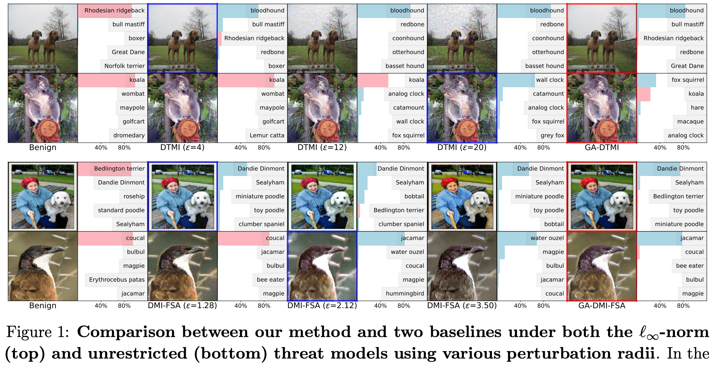
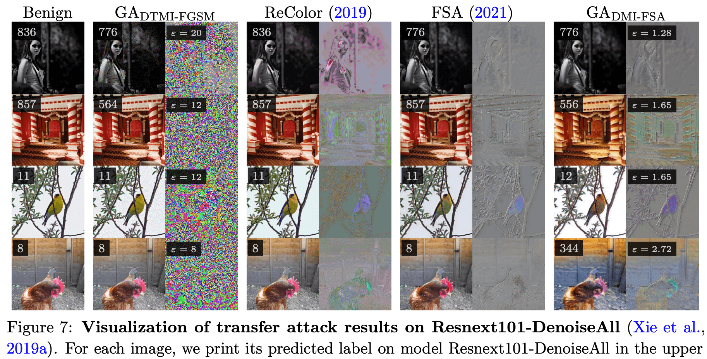

# Transferable Unrestricted Adversarial Examples

This is the PyTorch implementation of the
* SaTML 2023: [Towards Transferable Unrestricted Adversarial Examples
with Minimum Changes](https://arxiv.org/abs/2201.01102),
* No.1 solution of of CVPR’21 Security AI Challenger: [Unrestricted Adversarial Attacks on ImageNet Competition](https://arxiv.org/abs/2110.09903).

## Main Results

In this work, we propose a **geometry-aware** framework to generate **transferable unrestricted** adversarial examples with **minimum changes**. 

### Intuition of our geometry-aware framework

<p align="center">
    
</p>

> The perturbation budgets required for transfer-based attack are different for distinct images.

### Fooling adversarially trained robust models by transfer-based black-box attacks

<p align="center">
    
</p>

> GA-DMI-FSA generates **semantic-preserving** unrestricted adversarial examples by adjusting the images' color, texture, etc.


## Requirements

* Python >= 3.6
* Pytorch >= 1.0
* timm = 0.4.12
* einops = 0.3.2
* perceptual_advex = 0.2.6
* Numpy
* CUDA


## Data and Pretrained Models

The workspace is like this
```
├── assets
├── attacks
├── Competition
│   ├── code
│   ├── input_dir
│   │   └── images
│   └── output_dir
├── data
│   ├── ckpts
│   └── images
├── scripts
└── utils
```

You could download the `data/images` dataset from [google drive](https://drive.google.com/file/d/1M7Xc7guRKk_YuLoDf-xVv45HX3nh4r_-/view?usp=sharing) (140M) and the `data/ckpts` from [google drive](https://drive.google.com/file/d/1zwC4kx_9Kpe86e9iGwiNXxNjI7S7JP0F/view?usp=sharing) (1.63G).


## Usage


### Geometry-Aware framework

To reproduce the results of GA-DTMI-FGSM in Tab.3, run
```shell
bash scripts/run_main_ens.sh

# or with DistributedSampler
bash scripts/run_main_ens_dist.sh
```

To reproduce the results of GA-DMI-FSA in Tab.3, run
```shell
# with DistributedSampler
bash scripts/run_main_ens_fea_dist.sh
```


### Benchmarking models in Tab.3 under transfer-based attacks

To run the attack on a single GPU
```python
python main_bench_mark.py --input_path "path/of/adv_examples"
```
or with a `DistributedSampler`, i.e.,
```python
OMP_NUM_THREADS=1 python -m torch.distributed.launch --nproc_per_node=8 --master_port 26667 main_bench_mark.py --distributed --batch_size 40 --input_path "path/of/adv_examples"
```

To run the pgd-20 attack on model idx (0, 4, 7, etc.) in Tab. 3
```
python pgd_attack.py --source_id idx
```

